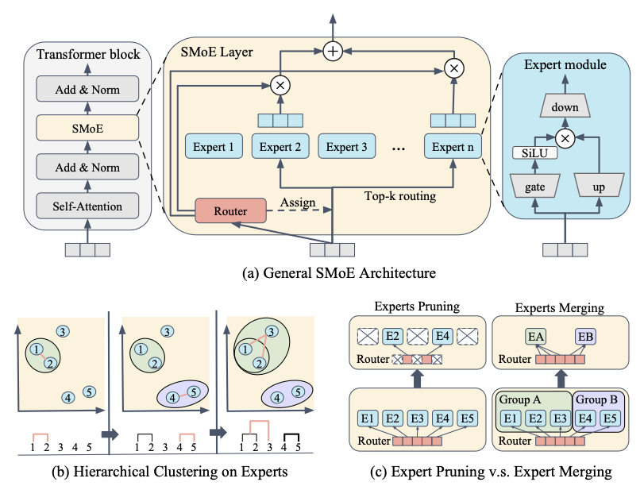

# Retraining-Free Expert Merging of Sparse Mixture-of-Experts via Hierarchical Clustering

In this work, we propose HC-SMoE (Hierarchical Clustering for Sparsely activated Mixture of Experts), a task-agnostic expert merging framework that reduces SMoE model parameters without retraining. Unlike previous methods, HC-SMoE employs hierarchical clustering based on expert outputs, ensuring that the merging process is unaffected by routing decisions. This output-based clustering strategy captures functional similarities between experts, offering an adaptable solution for models with numerous experts. We validate our approach through extensive experiments on eight zero-shot language tasks and demonstrate its effectiveness in large-scale SMoE models like Qwen and Mixtral. Our results show that HC-SMoE consistently achieves strong performance, highlighting its potential for real-world deployment.




## Code Description
This repository is written based on the codes in the [GitHub](https://github.com/UNITES-Lab/MC-SMoE).

## Setup
```
pip install -r requirements.txt
```

## Dataset Preparation
Please download the C4 training data c4-train.00000-of-01024.json from [allenai/c4](https://huggingface.co/datasets/allenai/c4/blob/main/en/c4-train.00000-of-01024.json.gz).

Then save it to path `hcsmoe/data/c4-train.00000-of-01024.json`.

Or you can assign the path in [hcsmoe/evaluation/minipile.py](./hcsmoe/evaluation/minipile.py).
```python
DATASETS = {
    'c4': lambda: load_dataset('json', data_files={'train': 'hcsmoe/data/c4-train.00000-of-01024.json'}, trust_remote_code=True),
}
```

## Experiments
We provide the code script in `scripts/mixtral/run.sh` and `scripts/qwen/run.sh`. Change the setting in those files. Run the script file as follows.

For detailed description for each argument, please see [here](./scripts/README.md).
```
bash scripts/mixtral/run.sh
bash scripts/qwen/run.sh
```
